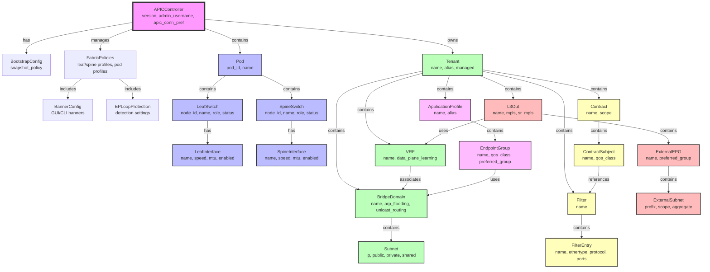

# cisco_netascode

Please refer to the [reference page](https://docs.infrahub.app/schema-library/reference/cisco_netascode) for the corresponding documentation.

## Overview

This schema provides a comprehensive data model for [Cisco's Network-as-Code schema](https://github.com/netascode/schema), focusing on Application Centric Infrastructure (ACI) components. It maps the Cisco NAC JSON schema structure to Infrahub's graph-based data model, enabling infrastructure-as-code practices for Cisco ACI deployments.

## Details

- **Dependencies:**
    - [base](dcim)

## Schema Structure

### Namespace

All nodes in this schema use the `Cisconac` namespace to maintain clear separation from other infrastructure models.

## Node Hierarchy

The schema implements a hierarchical structure that mirrors Cisco ACI's architecture:



## Node Categories

### 1. Controller and Configuration

#### APICController

The root node representing the APIC controller configuration.

- **Attributes:**
    - `version`: APIC software version (default: "5.2.1g")
    - `admin_username`: Administrative username
    - `apic_conn_pref`: Connection preference (inband/ooband)
- **Relationships:**
    - Has many `FabricPolicies`
    - Has many `Tenants`

#### BootstrapConfig

Initial bootstrap configuration for APIC.

- **Parent:** APICController
- **Attributes:**
    - `snapshot_policy`: Snapshot policy name

#### FabricPolicies

Global fabric policy configurations.

- **Parent:** APICController
- **Attributes:**
    - Leaf/Spine switch profile names
    - Leaf/Spine interface profile names
    - Pod profile names
    - Config passphrase
- **Components:**
    - `BannerConfig`
    - `EPLoopProtection`

### 2. Fabric Infrastructure

#### Pod

Represents an ACI Pod within the fabric.

- **Parent:** APICController
- **Attributes:**
    - `pod_id`: Unique pod identifier
    - `name`: Pod name
    - `description`: Pod description
- **Components:**
    - Multiple `LeafSwitch` nodes
    - Multiple `SpineSwitch` nodes

#### LeafSwitch / SpineSwitch

Fabric switches inheriting from the `FabricNode` generic.

- **Parent:** Pod
- **Attributes:**
    - `node_id`: Unique node identifier
    - `name`: Switch name
    - `status`: Operational status (active/provisioning/maintenance)
    - `role`: Switch role (leaf/spine)
- **Components:**
    - Multiple interface nodes

### 3. Tenant Structure

#### Tenant

Multi-tenancy container for logical network constructs.

- **Parent:** APICController
- **Attributes:**
    - `name`: Tenant name (unique)
    - `alias`: Alternative name
    - `managed`: Management flag
    - `ndo_managed`: NDO management flag
- **Components:**
    - VRFs, Bridge Domains, Application Profiles
    - Contracts, Filters, L3Outs

#### VRF (Virtual Routing and Forwarding)

Layer 3 forwarding context within a tenant.

- **Parent:** Tenant
- **Attributes:**
    - `name`: VRF name
    - `data_plane_learning`: Enable data plane learning
    - `preferred_group`: Preferred group membership
- **Associated Bridge Domains**

#### BridgeDomain

Layer 2 forwarding domain.

- **Parent:** Tenant
- **Attributes:**
    - `name`: Bridge domain name
    - `arp_flooding`: ARP flooding behavior
    - `unicast_routing`: Enable L3 routing
    - `unknown_unicast`: Unknown unicast handling (proxy/flood)
    - `l2_stretch`: Enable L2 stretch
- **Components:**
    - Multiple `Subnet` nodes

### 4. Application Components

#### ApplicationProfile

Container for related endpoint groups.

- **Parent:** Tenant
- **Attributes:**
    - `name`: Application profile name
    - `alias`: Alternative name
    - `description`: Description
- **Components:**
    - Multiple `EndpointGroup` nodes

#### EndpointGroup (EPG)

Collection of endpoints with common policy requirements.

- **Parent:** ApplicationProfile
- **Attributes:**
    - `name`: EPG name
    - `qos_class`: Quality of service class
    - `preferred_group`: Preferred group membership
    - `intra_epg_isolation`: Enable micro-segmentation
- **References:**
    - Associated `BridgeDomain`

### 5. Security Policies

#### Contract

Policy defining communication rules between EPGs.

- **Parent:** Tenant
- **Attributes:**
    - `name`: Contract name
    - `scope`: Contract scope (context/tenant/global/application-profile)
- **Components:**
    - Multiple `ContractSubject` nodes

#### Filter

Traffic classification rules.

- **Parent:** Tenant
- **Attributes:**
    - `name`: Filter name
- **Components:**
    - Multiple `FilterEntry` nodes

#### FilterEntry

Individual traffic matching rules.

- **Parent:** Filter
- **Attributes:**
    - `name`: Entry name
    - `ethertype`: Ethernet type (ipv4/ipv6/arp/etc.)
    - `protocol`: IP protocol
    - `source_from_port`, `source_to_port`: Source port range
    - `destination_from_port`, `destination_to_port`: Destination port range
    - `stateful`: Stateful inspection flag

### 6. External Connectivity

#### L3Out

Layer 3 outside network connection.

- **Parent:** Tenant
- **Attributes:**
    - `name`: L3Out name
    - `mpls`: Enable MPLS
    - `sr_mpls`: Enable Segment Routing MPLS
    - `pim`, `pimv6`: Multicast routing
- **References:**
    - Associated `VRF`
- **Components:**
    - Multiple `ExternalEPG` nodes

#### ExternalEPG

External network endpoint group.

- **Parent:** L3Out
- **Attributes:**
    - `name`: External EPG name
    - `preferred_group`: Preferred group membership
    - `qos_class`: Quality of service class
- **Components:**
    - Multiple `ExternalSubnet` nodes

## Relationship Types

The schema uses three primary relationship types:

1. **Parent**: Hierarchical ownership (e.g., Tenant → VRF)
2. **Component**: Strong composition (e.g., Pod → LeafSwitch)
3. **Attribute**: Loose association (e.g., EPG → BridgeDomain)

## Generics

### APICPolicy

Base class for APIC policy objects providing common attributes:

- `name`: Policy name (unique)
- `description`: Policy description

### FabricNode

Base class for fabric nodes (switches) providing:

- `node_id`: Unique node identifier
- `name`: Node name
- `status`: Operational status

## Key Features

### Uniqueness Constraints

Most nodes implement uniqueness constraints to ensure data integrity:

- Tenant-scoped: VRF, BridgeDomain, ApplicationProfile
- Parent-scoped: Interface names, EPG names
- Global: Tenant names, Pod IDs, Node IDs

### Human-Friendly IDs

Nodes like `Tenant` use human-friendly identifiers for easier reference in queries and operations.

### Validation

- Regex patterns for names (e.g., `^[a-zA-Z0-9_.:-]{1,64}$`)
- Min/max constraints for numeric values
- Enumerated choices for dropdown fields

### Default Values

The schema preserves default values from the original Cisco NAC specification:

- MTU: 1500
- Interface enabled: true
- VRF data plane learning: enabled
- Bridge domain unicast routing: enabled

## Usage Examples

### Creating a Basic Tenant Structure

```yaml
# Example data following this schema
- kind: CiscoNACTenant
  name: Production
  attributes:
    name: PROD
    alias: Production Environment
    managed: true

- kind: CiscoNACVRF
  name: Production-VRF
  attributes:
    name: PROD-VRF
    data_plane_learning: true
  relationships:
    tenant: Production

- kind: CiscoNACBridgeDomain
  name: Web-BD
  attributes:
    name: WEB-BD
    unicast_routing: true
    arp_flooding: false
  relationships:
    tenant: Production
    vrf: Production-VRF
```

### Defining Security Policies

```yaml
- kind: CiscoNACContract
  name: Web-to-DB
  attributes:
    name: WEB-DB-CONTRACT
    scope: tenant
  relationships:
    tenant: Production

- kind: CiscoNACFilter
  name: Database-Ports
  attributes:
    name: DB-FILTER
  relationships:
    tenant: Production

- kind: CiscoNACFilterEntry
  name: PostgreSQL
  attributes:
    name: POSTGRES
    ethertype: ipv4
    protocol: tcp
    destination_from_port: "5432"
    destination_to_port: "5432"
  relationships:
    filter: Database-Ports
```

## References

- [Cisco ACI Documentation](https://www.cisco.com/c/en/us/support/cloud-systems-management/application-policy-infrastructure-controller-apic/series.html)
- [Network-as-Code Initiative](https://github.com/netascode)
- [Infrahub Schema Documentation](https://docs.infrahub.app/topics/schema)
